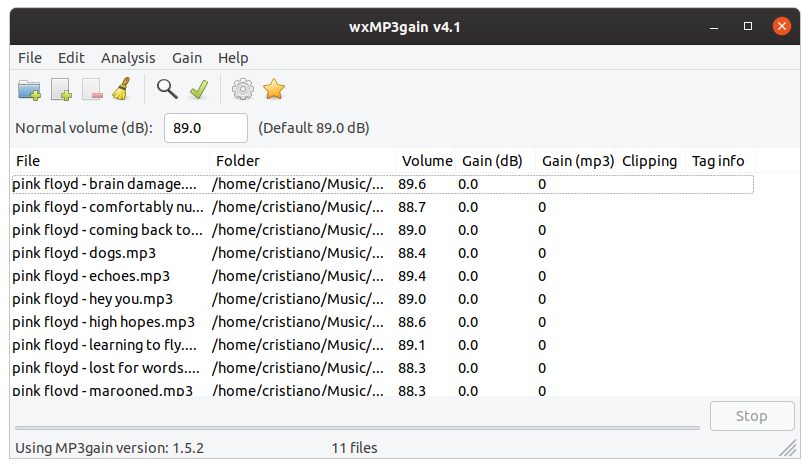

# wxMP3gain [](https://github.com/cfgnunes/wxmp3gain/actions)

wxMP3gain is a free front-end for the application [MP3gain](http://mp3gain.sourceforge.net/).



## Contributing

If you spot a bug, or want to improve the code, or even make the content better, you can do the following:

- [Open an issue](https://github.com/cfgnunes/wxmp3gain/issues/new) describing the bug or feature idea;
- Fork the project, make changes, and submit a pull request.

## Versioning

This project uses [SemVer](http://semver.org/) for versioning. For the versions available, see the [tags on this repository](https://github.com/cfgnunes/wxmp3gain/tags).

## Authors

- Cristiano Nunes

## License

This program is licensed under the terms of the [GNU General Public License version 3](http://www.gnu.org/licenses/gpl-3.0.html).

## Acknowledgments

- Carlos Sánchez - _Spanish translations_
- Jan Rimmek - _German translations_
- Pavel Fric - _Czech translations_
- Sergey Basalaev - _Russian translations_
- Yaşar Çiv - _Turkish translations_
- Dominko Aždajić - _Croatian translations_
- Maboroshin - _Japanese translations_

# Installation

For Windows and old Linux versions you can download the precompiled binaries. For current Linux versions the application needs to be built from sources.

## Precompiled Binaries

The precompiled binaries have been tested to work on the following platforms:

- Windows XP, Vista, 7, 8, 10
- Ubuntu 16.04 / 18.04

Link to download the precompiled binary files: <https://sourceforge.net/projects/wxmp3gain/>

**NOTE:** The precompiled binaries are outdated and do not work anymore on the Ubuntu 20.04 / Linux Mint 20.1 distributions and greater.

On Linux you can also install them via a **Personal Package Archive (PPA)**:

```sh
sudo add-apt-repository -y ppa:cfgnunes/ppa
sudo apt update
sudo apt install wxmp3gain
```

# Build from Sources

Alternatively to downloading the precompiled binaries, you can build the application using the source code.

## Dependencies

The project depends on the following tools

- [MP3gain](http://mp3gain.sourceforge.net/) - Analyze and adjust mp3 files so that they have the same volume
- [CMake](https://cmake.org/) - Build, test and package software

which you need to download and install before being able to build the project.

In order to create an installer on Windows, which is optional, the following dependency needs to be downloaded and installed:

- [Inno Setup](http://www.jrsoftware.org/isinfo.php) - Installer for Windows programs

The following further tools are needed, but **can** automatically be downloaded using CMake:

- [wxWidgets](http://wxwidgets.org/) - Open-Source GUI framework
- [gettext](https://www.gnu.org/software/gettext/) - Internationalization and localization (i18n and l10n) system

The tool `gettext` must be in the `PATH` environmental variable for CMake to find it.

For a manually installed wxWidgets you need to specify the `wxWidgets_ROOT_DIR` and `wxWidgets_LIB_DIR` in the CMake configuration phase. See the [FindwxWidgets](https://cmake.org/cmake/help/latest/module/FindwxWidgets.html) CMake module documentation.

## External Projects

As mentioned, some dependencies can be downloaded using CMake. The path where these dependencies are downloaded can be configured via the `CMAKE_EP_BASE_PATH` variable.

On Windows the default is `CMAKE_EP_BASE_PATH=%SYSTEMDRIVE%/Repositories/CMake`.

On Linux the default is `CMAKE_EP_BASE_PATH=$HOME/.repositories/cmake`.

You can specify the path passing an argument during the `configure` phase of CMake (see below).
Alternatively you can create an environmental variable called `CMAKE_EP_BASE_PATH` setting the path.

## Linux

On Linux the dependencies are best installed via your package manager, if available.

This section assumes you are using Ubuntu, but the procedure is similar for other Linux distributions.

### Prerequisites

The prerequisites to build the source is to install the following packages:

```sh
sudo apt -y install build-essential cmake
```

If wxWidgets should be automatically built and installed from sources, the following packages should be installed:

```sh
sudo apt -y install libgtk-3-dev libglm-dev libglew-dev libsdl2-dev
```

On **Ubuntu 16.04 / 18.04** you can install MP3gain and wxWidgets via the command:

```sh
sudo apt -y install mp3gain libwxgtk3.0-dev
```

On **Ubuntu 20.04, Linux Mint 20.1 & 20.2** the package `libwxgtk3.0-gtk3-dev` (instead of `libwxgtk3.0-dev`) needs to be installed.

```sh
sudo apt -y install libwxgtk3.0-gtk3-dev
```

The MP3gain executable is not available in the repositories, or rather only as a snap. You can download the `.deb` file for _Ubuntu Bionic_ (19.x) though, as it works also for _Ubuntu Focal_ (20.x).

```sh
sudo apt -y install wget
wget https://launchpad.net/~flexiondotorg/+archive/ubuntu/audio/+files/mp3gain_1.5.2-r2-6~bionic1.0_amd64.deb
sudo apt -y install ./mp3gain_1.5.2-r2-6~bionic1.0_amd64.deb
```

### Compile & Install

Compile the sources and install the binaries entering the following commands in the terminal. The arguments in brackets are optional.

```sh
cmake -S sources -B build \
	[-DCMAKE_INSTALL_PREFIX=/opt/wxMP3gain] \
	[-DWXMP3GAIN_USER_LAUNCHER_ONLY=true] \
	[-DCMAKE_EP_BASE_PATH=/opt/repositories/cmake]
cmake --build build
sudo cmake --install build
```

You can override the default install directory setting the [CMAKE_INSTALL_PREFIX](https://cmake.org/cmake/help/latest/variable/CMAKE_INSTALL_PREFIX.html) during configuration.

Install the `.desktop` file into the user's folder, instead of the global launcher folder, by setting the `WXMP3GAIN_USER_LAUNCHER_ONLY` argument to `true`.

## Windows

On Windows CMake and MP3gain need to be downloaded and installed manually.

You also need to install a toolchain compatible with CMake. The build was tested to work with:
- [MinGW](https://www.mingw-w64.org/) (installed via [MSYS2](https://www.msys2.org/))
- [Microsoft Visual Studio 2019](https://visualstudio.microsoft.com/de/vs/)

Optionally install **Inno Setup**, if you want to create an installer.

Optionally download and install **wxWidgets** and [gettext for Windows](https://github.com/mlocati/gettext-iconv-windows/). The project is configured to automatically download these two dependencies into the `CMAKE_EP_BASE_PATH`, if they are not found.

### MinGW

When building with MinGW, make sure there are no spaces in the path to the sources, else resource files (`*.res`) cannot be compiled and the design/symbols will look ugly.

Put the sources into a folder like `C:\wxMP3gain\`.

### Compile & Install

Compile the sources and install the binaries entering the following commands in the terminal. The arguments in brackets are optional.

```sh
cmake -S sources -B build \
	[-DCMAKE_EP_BASE_PATH=C:/temp] \
	[-DCMAKE_INSTALL_PREFIX=C:/wxMP3gain] \
	[-DwxWidgets_ROOT_DIR=C:/wxWidgets-2.6.3] \
	[-DwxWidgets_LIB_DIR=C:/wxWidgets-2.6.3/lib/vc_lib] 
cmake --build build
cmake --install build
```

Please note that if wxWidgets is not manually installed in beforehand, the configuration phase of CMake takes very long.

# Development

If you want to actively help developing wxMP3Gain, the scripts in the `generate/` folder, creating projects for some common IDEs, might by helpful.

The cross-platform IDE [Visual Studio Code](https://code.visualstudio.com/) is suggested to be used, which natively supports CMake and therefore no specific project needs to be created.
